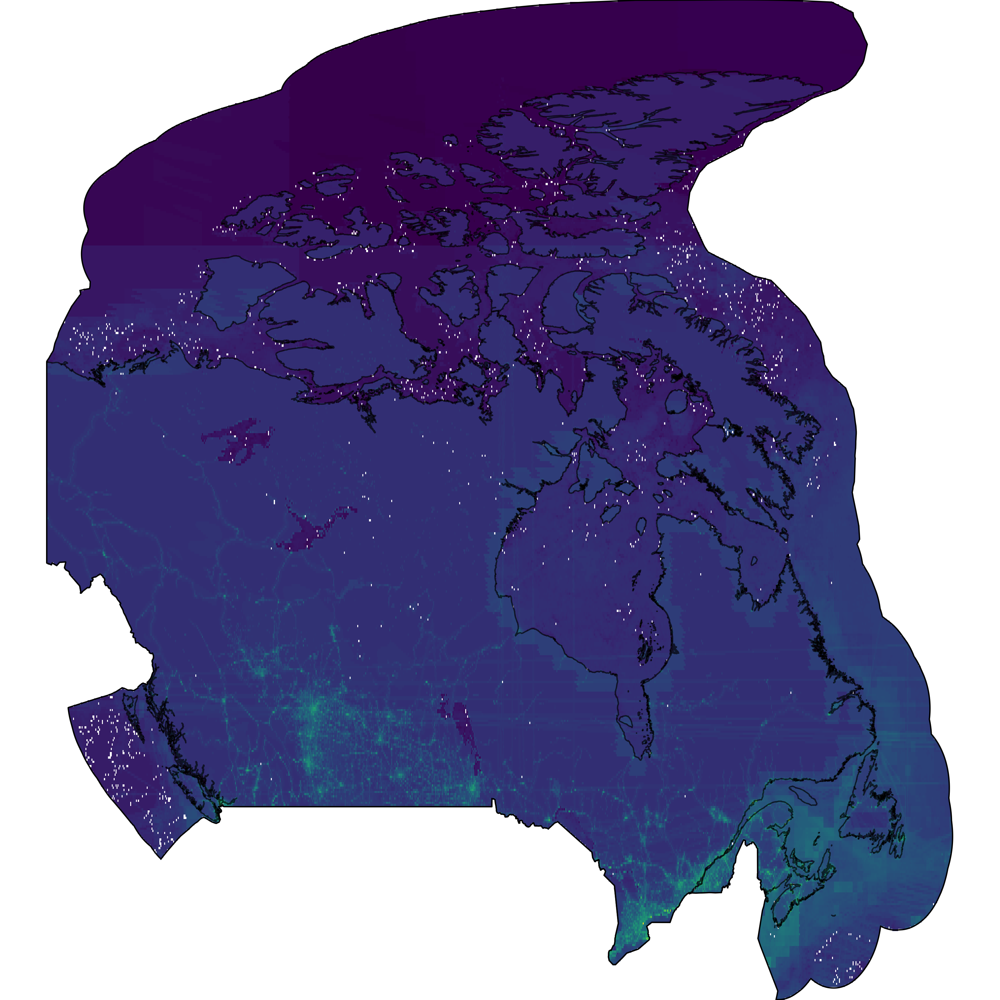

<!-- 
suppressWarnings(bookdown::render_book("index.Rmd", "bookdown::gitbook"))
-->

```{r setup, include = FALSE, purl = FALSE}
knitr::opts_chunk$set(
  comment = "#>",
  collapse = TRUE,
  warning = FALSE,
  echo = FALSE,
  message = FALSE,
  dev = "png",
  dpi = 108,
  fig.width = 8,
  fig.height = 6,
  fig.align = 'center',
  width = 120#,
  # table.attr = 'class="flat-table"'
)
```

# Project description

The goal of this project is to do an Canada-wide assessment of cumulative exposure to stressors that encompasses both terrestrial and marine environments in the Canadian exclusive economic zone. 


# Methods 

## Data 

We initiate this project by integrating the data from @venter2016 for terrestrial stressors and  @halpern2015 for marine stressors, which were both done at the global scale. We will then update whichever data are available and better than what was available globally to @venter2016 and @halpern2015.

### Stressors 

#### Terrestrial 

All terrestrial stressors currently come from @venter2016

- Built2009
- croplands2005
- Lights2009
- NavigableWater2009
- Pasture2009
- Populationdensity2010
- Railways
- Roads

#### Marine 

- artisanal_fishing
- demersal_destructive_fishing
- demersal_nondest_high_bycatch
- demersal_nondest_low_bycatch
- inorganic
- invasives
- night_lights
- ocean_acidification
- ocean_pollution
- oil_rigs
- pelagic_high_bycatch
- pelagic_low_bycatch
- plumes_fertilizers
- plumes_pesticides
- population
- shipping
- slr (Sea level rise)
- sst
- uv

# Results 

## Cumulative stressors 

```{r cumstr, fig.cap = "Cumulative stressors across Canadian terrestrial and marine ecosystems, using X terrestrial [@venter2016] and Y marine stressors [@halpern2015]. White spots are artefacts of data extraction and will be adjusted later in the process.", out.width = '100%'}

```

# References